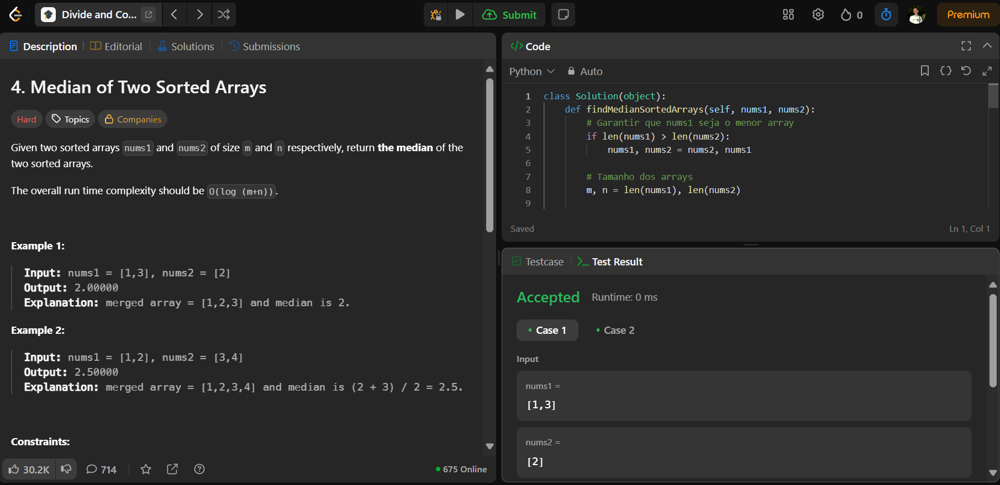

# 4. Median of Two Sorted Arrays

O arquivo [LCDC4.py](./LCDC4.py) apresenta a resolução do exercício número 4 sobre divide and conquer da plataforma LeetCode.

A resolução foi aceita pela plataforma, conforme a **Figura 1** abaixo:

**Figura 1** - Resolução da questão 4.

## Explicação da solução

Problema:
Encontrar a mediana da união de dois arrays ordenados.

Complexidade Esperada: O(log(min(m, n))) usando busca binária.

Solução:
Usamos divisão binária para encontrar a posição da mediana.

Dividimos o array menor e aplicamos uma técnica de partição para garantir que a metade esquerda de ambas as listas contenha os menores elementos.

Comparamos as bordas das listas para determinar a mediana.

Tempo: O(log(min(m, n)))

