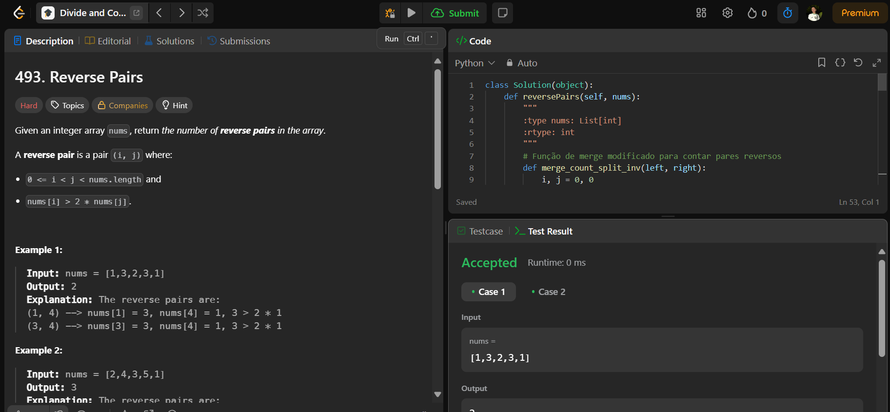

# 493. Reverse Pairs

O arquivo [LCDC493.py](./LCDC493.py) apresenta a resolução do exercício número 493 sobre dividir e conquistar da plataforma LeetCode.

A resolução foi aceita pela plataforma, conforme a **Figura 1** abaixo:

**Figura 1** - Resolução da questão 493.

## Explicação da solução

Problema:
Contar o número de pares reversos (i, j) em um array, onde i < j e nums[i] > 2 * nums[j].

Método: Merge Sort Modificado.

Solução:
Merge Sort é modificado para contar os pares reversos enquanto divide o array.

Durante o processo de fusão, contamos quantos elementos à esquerda de i formam pares reversos com o elemento à direita de j.

Tempo: O(n log n)