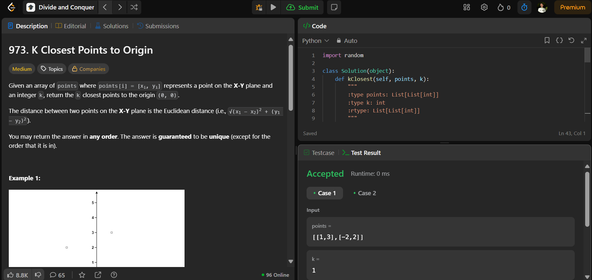

# 973. K Closest Points to Origin

O arquivo [LCDC973.py](./LCDC973.py) apresenta a resolução do exercício número 973 sobre dividir e conquistar da plataforma LeetCode.

A resolução foi aceita pela plataforma, conforme a **Figura 1** abaixo:

**Figura 1** - Resolução da questão 973.

## Explicação da solução

Problema:
Dado um conjunto de pontos em um plano 2D, retornar os k pontos mais próximos à origem (0, 0).

Método: Dividir e Conquistar utilizando Quickselect.

Solução:
Calculamos a distância Euclidiana ao quadrado de cada ponto até a origem (sem calcular a raiz quadrada para otimização).

Usamos Quickselect para encontrar os k pontos mais próximos sem precisar ordenar completamente os pontos.

Tempo: O(n log k)